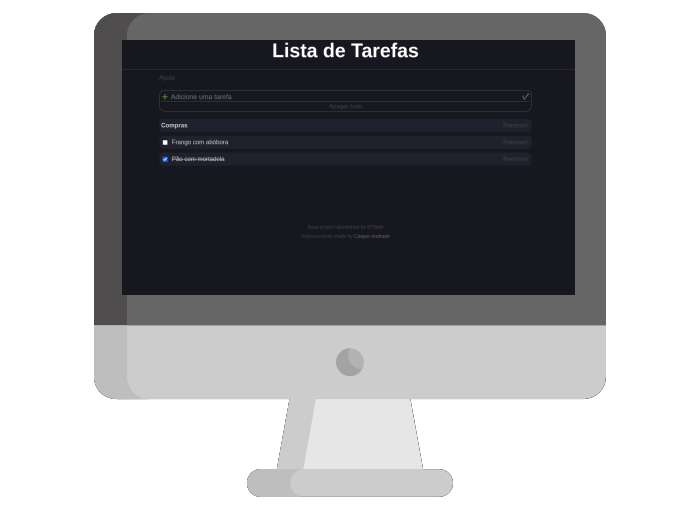

<h1 align="center">Lista de tarefas</h1>

    
  

<h2>:rocket: Tecnologias Usadas</h2>

  
  
  

<h2>:floppy_disk: Instalação</h2>

<code>npm install</code>

<h2>:dvd: Iniciar</h2>

<code>npm run dev</code>

<h2>:computer: Projeto</h2>

O aplicativo armazena os dados no Web Storage do navegador, logo é possível incluir, excluir e salvar tarefas.
É possivel escolher entre texo ou tarefa e organizar por meio de Drag and Drop.  
Há um menu de ajuda mais detalhado para o usuário.

<h2>:eyes: Implantação</h2>

Veja o projeto em [GitHub Pages](https://caiquedv.github.io/to-do_list_reactjs/).

